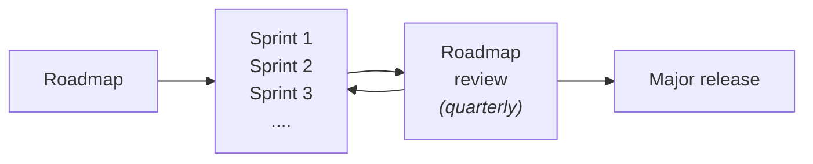

## The principles

As a team, we value:

- **Addressing real world challenges**: DHIS2 success story is rooted in a humble focus on addressing real world challenges. As a dev team, we should always realise that our focus is to address real world challenges. This can _often_ mean that "Pefect is the enemy of Good" but more than anything it means a sense of *pragmatism* that - as we scale - we aim for more than "just good" but we also don't lose track of delivering value, especially in the fast evolving world of frontend.

- **Flexibility and responsiveness**: This should be a general attitude in our communication and development work. We value our end-users and stakeholders and we understand - with humility - that our technical output serves them in the first place. We show that by being flexible, responsive and *empathetic* with their needs. Internally, we also exercise the same flexibility; we don't get too dogmatic about technical differences because technology is the means not the end.

- **Transparent efficient communication**: Transparency is at the core of what we do. **We see development as primarily an exercise in good communication and transparency**. Transparency builds trust, improves communication, accountability, and ensures we're always engaged with different stakeholders and view points to _not_ only build the things right, but also build the right things. Efficient communication means good meetings, good PRs, great documentation and great engagement with our end-users.  

We also value **Continuous improvement**. Every release, every sprint, every day, we aim to be better than the previous one. Our goal is always a moving target; it is to improve ourselves, our process and our product, and learn and grow from our experiences. 

Our way of working builds on these principles. This document defines some of the details of how we work (the process, the meetings, the technology etc..) but the details are an on-going process (continuous improvement) and the details should always be viewed, refined and _critiqued_ in the spirit provided by these principles.

## The Process

We work in iterations to deliver [our roadmap](https://dhis2.org/roadmap/) items during a release cycle (one year).

### Overview

The platform team works in **one-month sprints** (two months in the summer). The sprints start the first Tuesday of the month, and end the first Monday of the following month.

Before a new sprint, we have a **Sprint planning**. In the planning, we go through the tickets that we are commiting to for the next sprint/month. We have a brief discussion about them, any technical challenges, better way to break them etc.. The intention is to have tickets that can deliver value in a sprint.

    
Objectives of sprint planning

    - commit as a team to deliverables for the next sprint/month
    - highlight any issues that need further analysis
    - 

    A good sprint is one that:
    - commits to stories that are deliverable within the sprint
    - delivers stories that adds value to the product and relate to the roadmap
    - tackles some of the technical debt the team incurred.

Instead of a synchronous daily standup, we have an **async standup** that takes the form of a short update on Slack. We also have a weekly sync meeting, **Tuesday meeting**, that constitutes of two parts: The first includes the backend and frontend teams and goes through an update from each member of the teams, and provides an opportunity to discuss any issues that affect both frontend and backend. The second part is specific to the frontend where we:
- discuss any topics that need coordination and bringing up to the entire team
- go through the Jira board and make sure it reflects the state of work
- go through the PRs that need review and highlight them to the team

The frontend part of the meeting is run by a different person each week.

    
Objectives of async standup

    - focus your day: to decide - as a developer - what's your main focus for the day.
    - transparency: share with the team your plan for the day, and provide a chance for anyone to provide input.
    - impediments: highlight impediments (PRs waiting for review, backend issues..)
    - highlight any unplanned work that had to be done since the previous update.

    A good async standup update is:
    - NOT a work report, not a proof that you're around and working - we know you are.
    - addressed to the whole team - not the lead or manager.

We have a **retrospective** every two sprints. The retrospective represents an opportunity to reflect on the last period, and decide on actions and improvement for the next sprints.

    
Why sprints and all of that - a.k.a where we were before

        
    **high-level view**

    In Platform Frontend, we are a team of ~6 developers responsible for over 20 apps and libraries.

    The main lifecycle is the major release cycle. This used to be six months (two major releases per year), but it changed to one yearly release. Other than the major release, we have regular patches for the versions we support (last 3 versions).

    We get high-level requirements from **the roadmap** that translate into projects that are delivered during the lifecycle. The roadmap responsibility falls mainly with the functional design team, tech team leads, We also maintain existing projects, and libraries that are used through the DHIS2 ecosystem internally and externally.

    **From dev's perspective**

    Most of our projects tend to become a one-man project ("man", since we're also very lacking in diversity). This is mainly due to lack of resources, but often due to people's preference and the type of projects where having more than one person wouldn't necessary make things quicker.

    The main lifecycle while developing remains the major release. We've had attempts to break these long periods into shorter spans. We tried formal methods like sprints, but also informal methods like aligning with product demos and reviews.

    This causes issues with **estimation** (it's harder to estimate big projects) and **visibility** (it's hard to know what state projects are in). But it also works - we _generally_ deliver on our release commitments but with a cost.

    The cost to quality is in the shape of:

    - Lack of tests: we often end up sacrificing tests in order to deliver on these commitments
    - Lack of knowledge sharing: people working on silos tend to become experts with certain apps or parts of the system, while others don't.
    - Technical debt: taking shorcuts leads to technical debt that we don't get to tackle.

### Things we do differently
There are few things that we do different from the _typical_ agile/scrum way. This is mainly to adapt to our organisation's context:

- **Sprints are not set in stone**: There is a school - in Scrum specifically - that thinks that a sprint is set in stone once it's agreed and no changes should happen during the sprint's period. While we do commit for initial objectives, we are always adapting to new priorities and bugs that come through the sprint. For these, we try to:
    - see if they can wait to the next sprint: for most issues, this is possible.
    - discuss them in the next Tuesday meeting to bring in the current sprint
    - bring them immediately: If this is an urgent bug for example, then we bring it and work on it immediately. Just highlight it in the Slack channel (and make sure it is added to the sprint).

- **Group Estimation**: We don't estimate tickets as a group. We think this exercise, in its typical traditional form, doesn't add value. We do ask though that tickets have an estimation added by the person who knows most about them. The estimation value is in Fibonacci series (1,2,3,5,8,13..). This provides two benefits:
    - an opportunity to rethink large-ish tickets (8+ points) and see if they can be broken down into smaller deliverables.
    - clearly identify scope creep, i.e. tickets that are added mid-sprint, so that we can analyse sources of these requests and see how to better handle and anticipate them in the future.

### Things we don't do but intend to
- **Sprint Refinement**: prior to the _sprint planning_ meeting, a meeting is held that includes - at least - the Product Manager, Engineering Manager, Frontend lead and other stakeholders to go through the candidate issues and topics to work on for the next sprint. This feeds the sprint planning and aligns with the roadmap.
- **Review / Demo**: at the end of sprints, we intend to have demo session for what was accomplished. This will ideally be aligned with the demos run by the QA team.
- **Improve Backend / Frontend (and QA) alignment**: right now, this process doesn't include the backend team. We do have opportunities for alignment though, and we intend to improve these.
- **Share sprints goals with the wider organisation**: The idea of sprints/iterations is to provide transparency, both internally and to external stakeholders. We should regularly share our sprint objectives with the wider team (QA, Functional Design, UX etc..) and give them the opportunity to provide feedback before and after the sprint.

### Things we don't do and unlikely to ever do
- **Daily (synchronous) standups**:  Given our worldwide distribution, sync daily standups wouldn't work well. We do async standups now and they work as a first touch point for contact between team members. We should continue to tweak them (adjust frequency, questions, format etc..) to make them better but generally they work better than daily synchronous standups for our context.
- **Short sprints**: We think short sprints of 1-2 weeks are not suitable to the majority of our work, nor our team size. Our projects and tasks are often big and exploratory in nature, that a shorter sprint doesn't align well. In the same time, we think a sprint that is longer than a month would further hinder our transparency and the visibility of our progress. It will exacerbate the problem with people working in silos without any transparency or accountability about their progress. One month seems like the sweet spot, for the time being, but we will continue trialling and adjusting.

:::warning[Agile-ish]

We are avoiding the terms: "Agile", "Scrum", "Kanban" etc.. to describe our process. We aim to not be too dogmatic about the process and borrow what works for us from different processes and ways of working.

We also think that, while we should be open to what's common wisdom in the tech industry, the context of our project and the strong roots we have in research, academia and the scandinavian school of design should all equally affect our way of working. 

:::

### Definition of Done

- **Implemented and tested by the , a PR raised**:

- **Reviewed and Tested:** Reviews typically take the form of a Pull Request. As part of the PR process, the peer also tests the PR (this is facilitated by automated deployment for PRs we have for most projects). Once that's 

We would like to have **Unit Tested** also as part of the definition of Done. This is addressed in more details in the Way of Testing document, but for now, we're leaving it out of the DoD as we have a big legacy of untested work.

> todo: link to Way of testing

> todo: which tickets are tested by developers vs QA team

While most of our DoD is typical to most dev teams, there are bits that are specific to DHIS2 that we would like to highlight:

- **Localised**: Everything we do should be localiseable. For the frontend, we have a library [d2-i18n](https://github.com/dhis2/d2-i18n) that makes the process straightforward. From a developer perspective, this mostly means that all our strings values should be wrapped in a call to [i18n.t](https://github.com/search?q=org%3Adhis2%20i18n.t&type=code).

- **Backported**: We support the last three versions of DHIS2 backend. Most frontend applications are on [Continuous Delivery](https://github.com/dhis2/notes/discussions/293) which means we only have to update the main branch, and add feature toggles in the case of differences in the API. But for some apps and versions, we maintain version-specific branches, and any fixes to the main branch would need to be backported to these branches to make it to the next release.

- **Documented**: As an open-source project, we have to make sure that what we build is well-documented for other internal developers as well as external developers. This is especially true for the Platform team where a lot of what is built is tools and libraries for other developers.

- **Released**: 

We would like also to have in the DoD:

- **Accessible**: We have defined a minimum accessibility standard that we should adhere to. A lot of this will be taken care of by our core libraries, but once the core work is done, we should make sure that we don't regress in this regard and that accessiblity is taken into account while developing and testing.

- **RTL-friendly**: We support a growing number of right-to-left languages. We aim to make sure that our apps function well in RTL languages. This is achieved mostly by using logical CSS properties, and we have tools to support and automate that process (an example of their use in [this PR](https://github.com/dhis2/dashboard-app/pull/2985))

### Definition of Ready

## Roles

The main roles taking part in the sprint are:

- The Engineering Manager: They liaise between backend and frontend, and have the overall broad responsibility of managing the team, its progress, and ensuring we're delivering value aligned with the roadmap and the strategic goals of the organisation.

- The Product Manager: They are the link to other stake holders and end users (HISP groups, NGOs etc..). They define the roadmap through collaboration with these stake holders and ensure that what we do aligns with it. They have the responsibility that this roadmap is clearly communicated to us - developers - and translated into tickets and work deliverables. We have the responsibility to engage dynamically with them ensuring that the work is delivered in a timely manner and that they have visibility over progress and impediments at all time.

- The tech lead: they work closely with the engineering manager and the product manager to ensure that work is sufficiently estimated and ready to be picked up by developers. They are responsible of the sprint planning and getting a commitment from the team to deliver a sprint objectives. They also make sure that a portion of the sprint is spent on tackling technical debt and technical improvements needed to ensure the ongoing quality of what is delivered.

- The developers: they own the technical delivery of a functionality. They ensure that these are developed with good quality in a timely manner, and that their progress is transparent and well communicated.

    
 [Discussion Point] The unbearable muddiness of the "flat hierarchy"

    We typically describe ourselves as a "flat hierarchy". This might have been true in the early days of DHIS2, but  as the team scaled and got bigger, this is certainly not a view shared by developers anymore.

    The issue with this statement is that it muddies the reponsibilities and accountability for people at both ends of the hierarchy. It is better to acknowledge where we are now - NOT a flat hierarchy - and provide clear responisibilities and expectations.
    
    Becoming a flat hierarchy can be a goal, but it is not where we are. Otherwise this claim - from the perspective of developers - seems isolated from the day to day reality, and contradicts our process and organisational strucuture.

There are other important roles that are not always present in the day-to-day development work, but they are very important. 

**QA team** should be engaged periodically and tickets that need further testing and preparation are highlighted often. 

**UX** team provides designs for much of the work we do, but - given the size of the team - we often have to improvise designs. We overcome issues with that by following the design principles set by the UX team, build on common UI patterns and libraries, and over-communicate with the UX team to ensure what we build is aligned what they expect. **Functional Design** team has a major role in deciding what we build and what goes into the roadmap. We should proactively engage with them beyond the initial phases, and seek their feedback continuously as we build features, especially larger ones. This can take the form of meetings, or, preferably, periodic short updates on Slack, Jira and other channels.

## Communication patterns

We are a remote-first team. Our communication tends to be centered around these channels:

- Tuesday meetings: We have two meetings on Tuesday morning. One includes BE + FE teams, followed by one for each team separately. In the joint meeting, we

- Other regular meetings: Retrospective, DevEx meeting, bi-weekly Platform presentations etc...

- "top-down" communication: communicating roadmap, brown-bag sessions, all-hands

- Pull Requests

- Slack

- Jira

### Guidelines for effective comunication

Whatever the channel used for communication, we would like to follow an approach that is effective and follows our principles of empathy and transparency. These are some guidelines for effective communication that are a good starting point:

> Adapted from [GitLab communication handbook](https://about.gitlab.com/handbook/communication/)

1. Assume Positive Intent. Always begin with a position of positivity and grace.
1. Kindness Matters. You are looking at a screen, but you are really talking to a person. If you wouldn't say it to a person's face, do not send it to them in a text message.
1. Express Your Thoughts Responsibly and Inclusively. We live in different locations and often have very different perspectives. We want to know your thoughts, opinions, and feelings on things. We also ask you to consider the guidelines around communicating potentially sensitive topics.
1. Own It. If you say it or type it, own it. If it hurts the company or an individual, even unintentionally, we encourage you to look at things from other points of view and apologize easily.
1. Feedback is Essential. It is difficult to know what is appropriate in every one of our team members 60+ countries. We encourage team members to give feedback and receive feedback in a considerate way.
1. Do not underestimate a 1:1. Asynchronous communication (e.g., via text) is helpful and necessary. In some cases (e.g., to clarify misunderstandings) it can be much more effective to jump on a video call.
1. Focus on what we can directly influence. There are many factors we can't directly influence and we should avoid spending time discussing those things.

### Pull Requests as a communication tool

> todo: pull requests

#### Pairing is the new PR

## Resources
- Roadmap process: https://dhis2.org/roadmap/process/